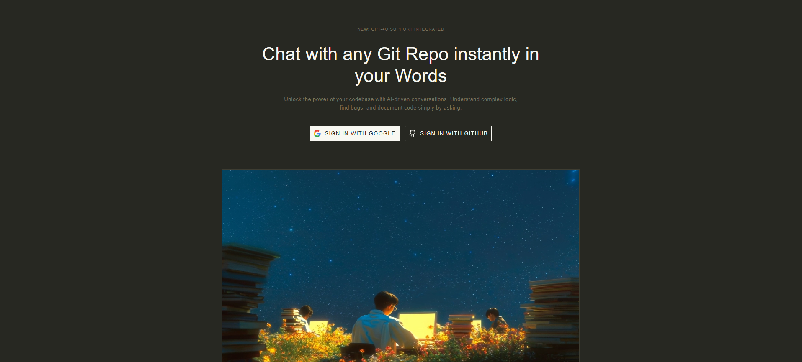
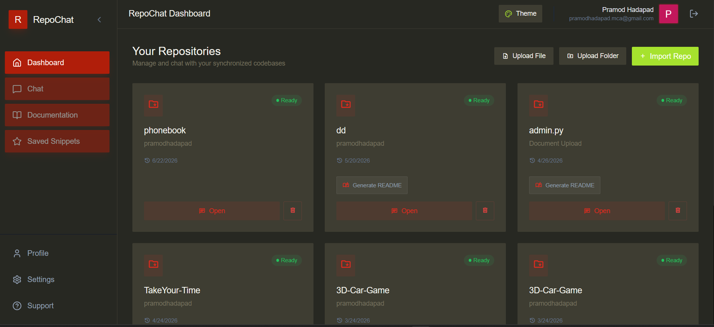
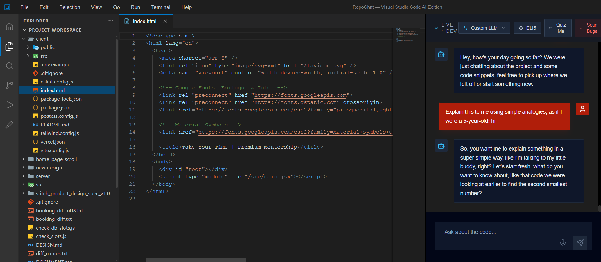
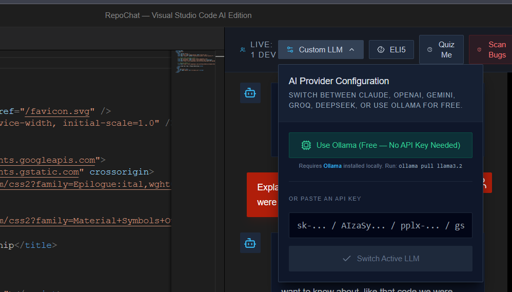

<div align="center">


<br/>

[](#)
[](#)
[](#)
[](#)
[](#license)

**RepoChat** is a full-stack AI-powered codebase chat application with a VSCode-style
interface — built solo as a final-year MCA project. Paste a repo, and chat with an
AI that understands your code.

[Live Demo](https://repochat-ai.vercel.app) · [Report a Bug](#) · [Request a Feature](#)

</div>

---

## 📖 Overview

RepoChat lets a developer point the app at a codebase and ask questions about it in
natural language — architecture questions, "where is X handled," "explain this
function" — inside a familiar VSCode-style layout (file explorer, code viewer, and
chat panel side by side).

Every chat message is handled through a three-stage pipeline rather than a single
raw LLM call, so responses stay grounded in the actual repo context instead of
guessing:

```
User message
     │
     ▼
┌─────────────────────┐
│   IntentDiscovery    │  → classifies the message (greeting / smalltalk / code query, etc.)
└──────────┬───────────┘
           ▼
┌─────────────────────┐
│     Orchestrator      │  → decides what repo context / files to pull in
└──────────┬───────────┘
           ▼
┌─────────────────────┐
│     ChatService       │  → builds the final prompt and streams the answer
└──────────────────────┘
```

---

## 📸 Screenshots

<p align="center">
  
</p>

<p align="center">
  
</p>

<p align="center">
  
</p>

<p align="center">
  
</p>


---

## ✨ Features

- 💬 **Chat with any repo** — indexed codebase context feeds the AI's answers
- 🖥️ **VSCode-style workspace** — File Explorer + Code Editor + Chat Window + Activity Bar, all in one layout
- 🔑 **Bring your own Groq API key** — stored AES-256-GCM encrypted, never in plaintext
- 🎁 **Free daily tokens** — 10k tokens/day per user via a shared backend key (24h reset) for users without their own key
- 📊 **Token balance bar** — live usage tracking in the model selector
- 🌗 **Dark-themed UI** — custom cyan (`#0db9f2`) accent on a deep slate (`#101e22`) background, Inter typeface
- ⚡ **Smart intent routing** — greetings and smalltalk are short-circuited before hitting the full RAG pipeline, saving tokens and latency

---

## 🛠 Tech Stack

| Layer | Technology |
|---|---|
| Frontend | React, Vite, Tailwind CSS |
| Backend | Node.js, Express |
| Database | MongoDB Atlas |
| AI / LLM | Groq API (LLaMA models) |
| Security | AES-256-GCM encryption for stored API keys |
| Hosting | Vercel (frontend), Render (backend) |
| Uptime | UptimeRobot ping every 5 min (mitigates Render free-tier cold starts) |

---

## 🏗 Project Structure (key files)

```
├── ChatService.js         # Final prompt assembly + streaming response
├── VectorIndexer.js        # Repo indexing for context retrieval
├── Orchestrator.js         # Decides what context to fetch per request
├── IntentDiscovery.js      # Classifies incoming message intent
├── LLMSelector.jsx         # Model picker + token balance UI
└── pages/
    ├── Landing.jsx
    ├── Dashboard.jsx
    ├── RepoChat.jsx         # Main VSCode-style workspace
    ├── Profile.jsx
    └── CollabLoader.jsx
```

---

## 🚀 Getting Started

### Prerequisites
- Node.js 18+
- A MongoDB Atlas cluster
- A Groq API key ([console.groq.com](https://console.groq.com))

### Installation

```bash
# Clone the repository
git clone https://github.com/pramodhadapad/Repochat.git
cd Repochat

# Install backend dependencies
cd server
npm install

# Install frontend dependencies
cd ../client
npm install
```

### Environment Variables

Create a `.env` file in the `server` directory:

```bash
PORT=5000
MONGO_URI=your-mongodb-atlas-connection-string
ENCRYPTION_KEY=your-32-byte-hex-key      # used for AES-256-GCM key encryption
GROQ_API_KEY=your-backend-groq-key       # powers the free daily token pool
CLIENT_URL=http://localhost:5173
```

Create a `.env` file in the `client` directory:

```bash
VITE_API_URL=http://localhost:5000
```

### Run locally

```bash
# Terminal 1 — backend
cd server
npm run dev

# Terminal 2 — frontend
cd client
npm run dev
```

Visit `http://localhost:5173`.

---

## 🌐 Deployment

| Service | Platform | URL |
|---|---|---|
| Frontend | Vercel | [repochat-ai.vercel.app](https://repochat-ai.vercel.app) |
| Backend | Render | repochat-backen.onrender.com |
| Database | MongoDB Atlas | — |

> ⚠️ **Note:** The backend runs on Render's free tier, so the first request after
> inactivity may take 30–60 seconds to wake up ("Waking up indexer..." shown in the UI).
> UptimeRobot pings the server every 5 minutes to reduce this.

---

## 🎯 Roadmap

- [ ] Support additional LLM providers alongside Groq
- [ ] Persistent repo indexing across Render restarts
- [ ] Multi-file diff-aware chat context
- [ ] Improved handling of very large repositories

---

## 👤 Author

**Pramod Hadapad**
Final-year MCA, Chetan Business School (CBS), Hubli — Karnatak University Dharwad (KUD)
[GitHub](https://github.com/pramodhadapad) · [LinkedIn](#)

---

## 📄 License

This project is available under the MIT License.
